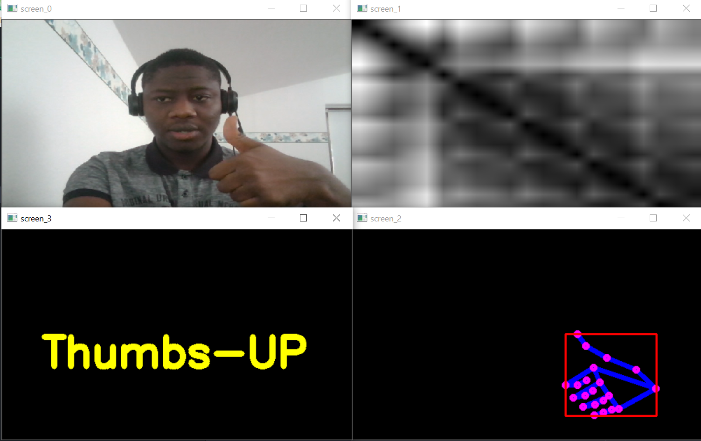

# Multimodal Arch (CNN and MLP) for Hand Gesture Recognition

## Overview

This Python project leverages OpenCV, MediaPipe, and Keras 3 to create a comprehensive system for building a hand gesture database using your webcam, constructing and training a multimodal neural network, and performing real-time hand gesture recognition.

  
  <h6 align="center">
    Me with an example of prediction
  </h6>  

## Features

1. Hand Gesture Database Creation:
    - Utilizes OpenCV and MediaPipe for real-time hand tracking using your webcam.
    - Captures and stores hand gestures in a database for training a recognition model.

2. Multimodal Network Construction:
    - Implements a multimodal neural network using Keras 3.

3. Training:
    - Prepares and preprocesses hand gesture data for training the multimodal network.
    - Trains the model on the created hand gesture database.

4. Real-time Recognition:
    - Employs the trained model for real-time hand gesture recognition.
    - Provides instant feedback on recognized gestures through the webcam feed.

## Requirements

- Python 3.10 or later
- Click
- Keras 3
- OpenCV
